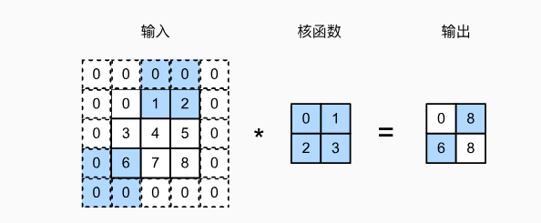
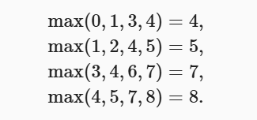

# 实验任务一： 图像卷积
## 互相关运算
如图中所示，考虑一个3x3矩阵作为输入张量，卷积核定义为一个2x2矩阵。


在二维互相关运算中，卷积窗口从输入张量的左上角开始，从左到右、从上到下滑动。 
当卷积窗口滑动到新一个位置时，包含在该窗口中的部分张量与卷积核张量进行按元素相乘，
得到的张量再求和得到一个单一的标量值，由此我们得出了这一位置的输出张量值。 
在如上例子中，输出张量的四个元素由二维互相关运算得到，这个输出高度为2、宽度为2

具体计算过程如下所示


注意，输出大小略小于输入大小。这是因为卷积核的宽度和高度大于1， 而卷积核只与图像中
每个大小完全适合的位置进行互相关运算。给出如下计算公式计算输出矩阵的大小。


在之前图中例子中，输入为3x3张量，卷积核为2x2张量，那么输出张量形状则为(3-2+1)x
(3-2+1)

接下来，我们在corr2d函数中实现如上过程，该函数接受输入张量X和卷积核张量K，
并返回输出张量Y

```bash
import torch
from torch import nn

def corr2d(X, K):  #@save
    """计算二维互相关运算"""
    h, w = K.shape
    Y = torch.zeros((X.shape[0] - h + 1, X.shape[1] - w + 1))
    for i in range(Y.shape[0]):
        for j in range(Y.shape[1]):
            Y[i, j] = (X[i:i + h, j:j + w] * K).sum()
    return Y
```
测试
```bash
X = torch.tensor([[0.0, 1.0, 2.0], [3.0, 4.0, 5.0], [6.0, 7.0, 8.0]])
K = torch.tensor([[0.0, 1.0], [2.0, 3.0]])
corr2d(X, K)
```
输出
```bash
tensor([[19., 25.],
        [37., 43.]])
```
卷积层对输入和卷积核权重进行互相关运算，并在添加标量偏置之后产生输出。 所以，
卷积层中的两个被训练的参数是卷积核权重和标量偏置。 就像我们之前随机初始化全连接
层一样，在训练基于卷积层的模型时，我们也随机初始化卷积核权重。

基于上面定义的corr2d函数实现二维卷积层。在__init__构造函数中，将weight
和bias声明为两个模型参数。前向传播函数调用corr2d函数并添加偏置。

```bash
class Conv2D(nn.Module):
    def __init__(self, kernel_size):
        super().__init__()
        self.weight = nn.Parameter(torch.rand(kernel_size))
        self.bias = nn.Parameter(torch.zeros(1))

    def forward(self, x):
        return corr2d(x, self.weight) + self.bias
```
## 填充和步幅
本节我们将介绍填充（padding）和步幅（stride）。假设以下情景： 
有时，在应用了连续的卷积之后，我们最终得到的输出远小于输入大小。
这是由于卷积核的宽度和高度通常大于
所导致的。比如，一个240x240 像素的图像，经过10层 5x5的卷积后，将减少到200x200
像素。如此一来，原始图像的边界丢失了许多有用信息。
而填充是解决此问题最有效的方法； 
有时，我们可能希望大幅降低图像的宽度和高度。例如，
如果我们发现原始的输入分辨率十分冗余。步幅则可以在这类情况下提供帮助。

### 填充
如上所述，在应用多层卷积时，我们常常丢失边缘像素。 由于我们通常使用小卷积核，
因此对于任何单个卷积，我们可能只会丢失几个像素。 但随着我们应用许多连续卷积层，
累积丢失的像素数就多了。 解决这个问题的简单方法即为填充（padding）：
在输入图像的边界填充元素（通常填充元素是 0）。 
例如，在下图中，我们将3x3输入填充到5x5，那么它的输出就增加为4x4 。
阴影部分是第一个输出元素以及用于输出计算的输入和核张量元素：0x0+0x1+0x2+0x3=0
。


假设我们原张量形状为nxn，卷积核为kxk，我们在原张量的基础上填充A行，在原张量基础上
填充B列，那么在进行互相关运算后，得到的输出形状为(n+A-k+1)x(n+B-K+1),
在图中的例子中，输出初始是3x3，我们在填充了两行（上下各一行）以及两列，那么新的张量
为5x5， 通过运算后，得到形状为(5-2+1)x(5-2+1)

在下面的例子中，我们创建一个高度和宽度为3的二维卷积层，并在所有侧边填充1个像素。
给定高度和宽度为8的输入，则输出的高度和宽度也是8。
```bash
import torch
from torch import nn


# 为了方便起见，我们定义了一个计算卷积层的函数。
# 此函数初始化卷积层权重，并对输入和输出提高和缩减相应的维数
def comp_conv2d(conv2d, X):
    # 这里的（1，1）表示批量大小和通道数都是1
    X = X.reshape((1, 1) + X.shape)
    Y = conv2d(X)
    # 省略前两个维度：批量大小和通道
    return Y.reshape(Y.shape[2:])

# 请注意，这里每边都填充了1行或1列，因此总共添加了2行或2列
conv2d = nn.Conv2d(1, 1, kernel_size=3, padding=1)
X = torch.rand(size=(8, 8))
comp_conv2d(conv2d, X).shape
```
输出是：
```bash
torch.Size([8, 8])
```
### 步幅
在计算互相关时，卷积窗口从输入张量的左上角开始，向下、向右滑动。 在前面的例子中
，我们默认每次滑动一个元素。 但是，有时候为了高效计算或是缩减采样次数，
卷积窗口可以跳过中间位置，每次滑动多个元素。

我们将每次滑动元素的数量称为步幅（stride）。到目前为止，我们只使用过高度或
宽度为1 的步幅，那么如何使用较大的步幅呢？ 下图是垂直步幅为3 ，水平步幅为2
的二维互相关运算。 着色部分是输出元素以及用于输出计算的输入和内核张量元素：



在这里给出输出形状的新计算公式：


其中除法运算均向下取整。以图中举例，初始为3x3，填充2行2列，在水平方向步长为2
，在竖直方向步长为3，那么有在水平方向有(3-2+2+2)/2=2(注意向下取整)，在竖直
方向(3-2+2+3)/3=2,最后输出为2x2

```bash
conv2d = nn.Conv2d(1, 1, kernel_size=3, padding=1, stride=2)
comp_conv2d(conv2d, X).shape
```
输出：
```bash
torch.Size([4, 4])
```
```bash
conv2d = nn.Conv2d(1, 1, kernel_size=(3, 5), padding=(0, 1), stride=(3, 4))
comp_conv2d(conv2d, X).shape
```
输出：
```bash
torch.Size([2, 2])
```
## 多输入输出通道
彩色图像具有标准的RGB通道来代表红、绿和蓝。 但是到目前为止，我们仅展示了单个输入
和单个输出通道的简化例子。 这使得我们可以将输入、卷积核和输出看作二维张量。

当我们添加通道时，我们的输入和隐藏的表示都变成了三维张量。例如，每个RGB输入图像
具有3 x h x w 的形状。我们将这个大小为3的轴称为通道（channel）维度。
本节将更深入地研究具有多输入和多输出通道的卷积核。
### 多输入通道

当输入包含多个通道时，需要构造一个与输入数据具有
相同输入通道数的卷积核，以便与输入数据进行互相关运算。


如图中所示，现在输入形状为2x3x3，即有两个通道，卷积核形状为2x2x2。
图中加深部分计算过程为：(1x1+2x2+4x3+5x4)+(0x0+1x1+3x2+4x3)=56

```bash
import torch
from torch import nn

def corr2d(X, K):  #@save
    """计算二维互相关运算"""
    h, w = K.shape
    Y = torch.zeros((X.shape[0] - h + 1, X.shape[1] - w + 1))
    for i in range(Y.shape[0]):
        for j in range(Y.shape[1]):
            Y[i, j] = (X[i:i + h, j:j + w] * K).sum()
    return Y
    
import torch

def corr2d_multi_in(X, K):
    # 先遍历“X”和“K”的第0个维度（通道维度），再把它们加在一起
    return sum(corr2d(x, k) for x, k in zip(X, K))
```
构造与图中相同输入与卷积核
```bash
X = torch.tensor([[[0.0, 1.0, 2.0], [3.0, 4.0, 5.0], [6.0, 7.0, 8.0]],
               [[1.0, 2.0, 3.0], [4.0, 5.0, 6.0], [7.0, 8.0, 9.0]]])
K = torch.tensor([[[0.0, 1.0], [2.0, 3.0]], [[1.0, 2.0], [3.0, 4.0]]])

corr2d_multi_in(X, K)
```
输出：
```bash
tensor([[ 56.,  72.],
        [104., 120.]])
```

### 多输出通道
到目前为止，不论有多少输入通道，我们还只有一个输出通道。在最流行的神经网络架构中
，随着神经网络层数的加深， 我们常会增加输出通道的维数，
通过减少空间分辨率以获得更大的通道深度。


举例来说，如上图所示，输入形状为3x3x3，卷积核为3x1x1x2，
卷积核第一个维度表示3个输入通道,(注意，在实际应用中各个维度代表的含义根据例子
来决定)，
最后一个维度表示2个输出通道，输出形状为2x3x3


如下所示，我们实现一个计算多个通道的输出的互相关函数。
```bash
def corr2d_multi_in_out(X, K):
    # 迭代“K”的第0个维度，每次都对输入“X”执行互相关运算。
    # 最后将所有结果都叠加在一起
    return torch.stack([corr2d_multi_in(X, k) for k in K], 0)

K = torch.stack((K, K + 1, K + 2), 0)
K.shape 
```
结果如下，在这里我们的输出通道放在第0维：
```bash
torch.Size([3, 2, 2, 2])
```

下面，我们对输入张量X与卷积核张量K执行互相关运算。现在的输出包含3
个通道，
```bash
X = torch.tensor([[[0.0, 1.0, 2.0], [3.0, 4.0, 5.0], [6.0, 7.0, 8.0]],
               [[1.0, 2.0, 3.0], [4.0, 5.0, 6.0], [7.0, 8.0, 9.0]]])
corr2d_multi_in_out(X, K)
```
```bash
tensor([[[ 56.,  72.],
         [104., 120.]],

        [[ 76., 100.],
         [148., 172.]],

        [[ 96., 128.],
         [192., 224.]]])
```
## 汇聚层

通常当我们处理图像时，我们希望逐渐降低隐藏表示的空间分辨率、聚集信息，
这样随着我们在神经网络中层叠的上升，每个神经元对其敏感的感受野（输入）就越大。

本节将介绍汇聚（pooling）层，它具有双重目的：
降低卷积层对位置的敏感性，同时降低对空间降采样表示的敏感性。

### 最大汇聚层和平均汇聚层
与卷积层类似，汇聚层运算符由一个固定形状的窗口组成，该窗口根据其步幅大小在输入的
所有区域上滑动，为固定形状窗口（有时称为汇聚窗口）遍历的每个位置计算一个输出。 
然而，不同于卷积层中的输入与卷积核之间的互相关计算，汇聚层不包含参数。
相反，池运算是确定性的，我们通常计算汇聚窗口中所有元素的最大值或平均值。
这些操作分别称为最大汇聚层（maximum pooling）和平均汇聚层（average pooling）。

在这两种情况下，与互相关运算符一样，
汇聚窗口从输入张量的左上角开始，从左往右、从上往下的在输入张量内滑动。
在汇聚窗口到达的每个位置，它计算该窗口中输入子张量的最大值或平均值。
计算最大值或平均值是取决于使用了最大汇聚层还是平均汇聚层。


图中的输出张量的高度为2，宽度为2 。这四个元素为每个汇聚窗口中的最大值：



在下面的代码中的pool2d函数，我们实现汇聚层的前向传播。
然而，这里我们没有卷积核，输出为输入中每个区域的最大值或平均值。

```bash
import torch
from torch import nn

def pool2d(X, pool_size, mode='max'):
    p_h, p_w = pool_size
    Y = torch.zeros((X.shape[0] - p_h + 1, X.shape[1] - p_w + 1))
    for i in range(Y.shape[0]):
        for j in range(Y.shape[1]):
            if mode == 'max':
                Y[i, j] = X[i: i + p_h, j: j + p_w].max()
            elif mode == 'avg':
                Y[i, j] = X[i: i + p_h, j: j + p_w].mean()
    return Y
```
构造输入：
```bash
X = torch.tensor([[0.0, 1.0, 2.0], [3.0, 4.0, 5.0], [6.0, 7.0, 8.0]])
pool2d(X, (2, 2))
```
输出为：
```bash
tensor([[4., 5.],
        [7., 8.]])
```
此外，我们还可以验证平均汇聚层。
```bash
pool2d(X, (2, 2), 'avg')
```
```bash
tensor([[2., 3.],
        [5., 6.]])
```
### 汇聚层填充与步幅

与卷积层一样，汇聚层也可以改变输出形状。和以前一样，
我们可以通过填充和步幅以获得所需的输出形状。 
下面，我们用深度学习框架中内置的二维最大汇聚层，
来演示汇聚层中填充和步幅的使用。 
我们首先构造了一个输入张量X，它有四个维度，其中样本数和通道数都是1。
```bash
X = torch.arange(16, dtype=torch.float32).reshape((1, 1, 4, 4))
X
```
```bash 
tensor([[[[ 0.,  1.,  2.,  3.],
          [ 4.,  5.,  6.,  7.],
          [ 8.,  9., 10., 11.],
          [12., 13., 14., 15.]]]])
```
默认情况下，深度学习框架中的步幅与汇聚窗口的大小相同。 
因此，如果我们使用形状为(3, 3)的汇聚窗口，
那么默认情况下，我们得到的步幅形状为(3, 3)。
```bash
pool2d = nn.MaxPool2d(3)
pool2d(X)
```
```bash
tensor([[[[10.]]]])
```

### 多个通道
在处理多通道输入数据时，汇聚层在每个输入通道上单独运算，
而不是像卷积层一样在通道上对输入进行汇总。
这意味着汇聚层的输出通道数与输入通道数相同。 
下面，我们将在通道维度上连结张量X和X + 1，以构建具有2个通道的输入。

```bash
X = torch.cat((X, X + 1), 1)
X
```
```bash
tensor([[[[ 0.,  1.,  2.,  3.],
          [ 4.,  5.,  6.,  7.],
          [ 8.,  9., 10., 11.],
          [12., 13., 14., 15.]],

         [[ 1.,  2.,  3.,  4.],
          [ 5.,  6.,  7.,  8.],
          [ 9., 10., 11., 12.],
          [13., 14., 15., 16.]]]])
```
如下所示，汇聚后输出通道的数量仍然是2。
```bash
pool2d = nn.MaxPool2d(3, padding=1, stride=2)
pool2d(X)
```
```bash
tensor([[[[ 5.,  7.],
          [13., 15.]],

         [[ 6.,  8.],
          [14., 16.]]]])
```
## 练习  图像中目标的边缘检测
如下是卷积层的一个简单应用：通过找到像素变化的位置，来检测图像中不同颜色的边缘。 首先，我们构造一个
6x8像素的黑白图像。中间四列为黑色（0），其余像素为白色（1）。

```bash
import torch
from torch import nn
X = torch.ones((6, 8))
X[:, 2:6] = 0
X
```
```bash
tensor([[1., 1., 0., 0., 0., 0., 1., 1.],
        [1., 1., 0., 0., 0., 0., 1., 1.],
        [1., 1., 0., 0., 0., 0., 1., 1.],
        [1., 1., 0., 0., 0., 0., 1., 1.],
        [1., 1., 0., 0., 0., 0., 1., 1.],
        [1., 1., 0., 0., 0., 0., 1., 1.]])
```
接下来，我们构造一个高度为1、宽度为2的卷积核K。当进行互相关运算时，
如果水平相邻的两元素相同，则输出为零，否则输出为非零。
```bash
K = torch.tensor([[1.0, -1.0]])
```
```bash
def corr2d(X, K):  #@save
    """计算二维互相关运算"""
    h, w = K.shape
    Y = torch.zeros((X.shape[0] - h + 1, X.shape[1] - w + 1))
    for i in range(Y.shape[0]):
        for j in range(Y.shape[1]):
            Y[i, j] = (X[i:i + h, j:j + w] * K).sum()
    return Y
Y = corr2d(X, K)
Y
```
输出为：
```bash
tensor([[ 0.,  1.,  0.,  0.,  0., -1.,  0.],
        [ 0.,  1.,  0.,  0.,  0., -1.,  0.],
        [ 0.,  1.,  0.,  0.,  0., -1.,  0.],
        [ 0.,  1.,  0.,  0.,  0., -1.,  0.],
        [ 0.,  1.,  0.,  0.,  0., -1.,  0.],
        [ 0.,  1.,  0.,  0.,  0., -1.,  0.]])
```
现在我们将输入的二维图像转置，再进行如上的互相关运算。 其输出如下，之前检测到的垂直边缘消失了。
不出所料，这个卷积核K只可以检测垂直边缘，无法检测水平边缘。
```bash
corr2d(X.t(), K)
```
输出：
```bash
tensor([[0., 0., 0., 0., 0.],
        [0., 0., 0., 0., 0.],
        [0., 0., 0., 0., 0.],
        [0., 0., 0., 0., 0.],
        [0., 0., 0., 0., 0.],
        [0., 0., 0., 0., 0.],
        [0., 0., 0., 0., 0.],
        [0., 0., 0., 0., 0.]])
````
1.请使用Conv2D类,补全训练部分代码，
使得训练得到的卷积核参数接近torch.tensor([[1.0, -1.0]])
```bash
class Conv2D(nn.Module):
    def __init__(self, kernel_size):
        super().__init__()
        self.weight = nn.Parameter(torch.rand(kernel_size))
        self.bias = nn.Parameter(torch.zeros(1))

    def forward(self, x):
        return corr2d(x, self.weight) + self.bias
```
```bash
# 构造一个二维卷积层，它具有1个输出通道和形状为（1，2）的卷积核
conv2d = nn.Conv2d(1,1, kernel_size=(1, 2), bias=False)

# 这个二维卷积层使用四维输入和输出格式（批量大小、通道、高度、宽度），
# 其中批量大小和通道数都为1
X = X.reshape((1, 1, 6, 8))#
Y = Y.reshape((1, 1, 6, 7))#标签

#训练补全部分(自定义损失函数，训练epoch，学习率等)
#TODO：for循环epoch次
#TODO：前向传播
#TODO：计算损失
#TODO: 清除梯度
#TODO: 反向传播
#TODO: 更新参数
```
```bash
conv2d.weight.data.reshape((1, 2))
#要求此输出接近torch.tensor([[1.0, -1.0]])，
# 如tensor([[ 0.9997, -0.9810]])
```