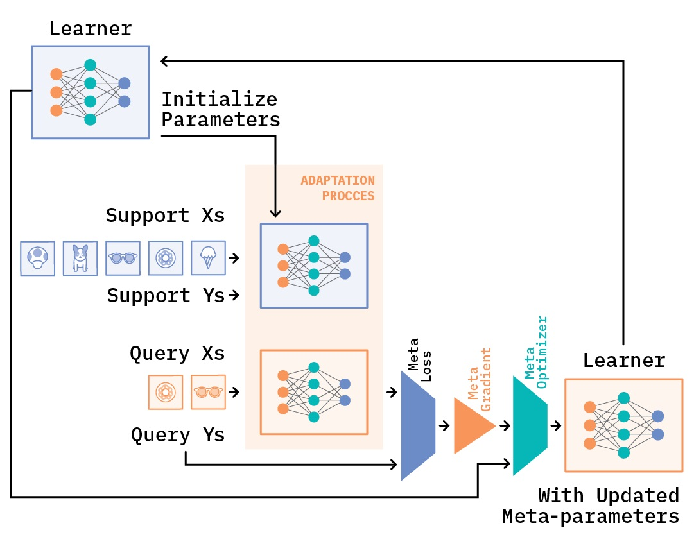

<!-- ```markdown -->
# 深度学习中的迁移学习与元学习

## 概述
本节课通过对比机器学习、迁移学习和元学习的核心思想，帮助同学们理解不同范式解决人工智能任务时的设计哲学差异，通过实验掌握元学习算法MAML以及Few-shot Learning。

---

## 第一章 机器学习（Machine Learning）
### 1.1 基本概念
- **任务导向**：为特定任务从头训练模型
- **数据依赖**：需要大量标注数据
- **训练方式**：端到端（End-to-End）训练
- **局限性**：难以快速适应新任务


### 1.2 典型场景
- 图像分类（ImageNet）
- 文本分类（IMDB影评）
- 语音识别（特定语种）

---

## 第二章 迁移学习（Transfer Learning）
### 2.1 核心思想
- **知识复用**：利用已有模型解决新任务
- **关键策略**：
  - 特征提取器冻结
  - 顶层微调（Fine-tuning）
  - 领域适应（Domain Adaptation）


---

## 第三章 元学习（Meta Learning）
### 3.1 学习范式革新
- **核心目标**：学会学习（Learn to Learn）
  - 以分类任务为例，元学习输出的并非是最终的分类结果，而是一个中间模型F，换句话说，F的模型结构，模型初始化参数或者学习率等是元学习需要求解的。得到模型F之后，需要利用下游任务的数据对F进行微调，得到f，这才是最终的分类模型。
  
  - 在机器学习中，以图像分类任务为例，训练样本就是图像和标签，在训练过程中每次会从训练集中采样batch size个图像及其对应的标签进行训练。而在元学习中，我们采样的并非图像和标签，而是任务（Task）。以下图为例，我们从训练集中采样了2个任务，这两个任务分别为猫和狗的二分类任务以及犰狳和穿山甲的二分类任务，每个任务我们都采用交叉熵损失进行优化，那么最终的损失就是所有任务上的损失之和。
  
  - 另一个与机器学习不同的点在于，在元学习中，不管是训练集还是测试集中的任务，每个任务都会有自己的训练集和测试集。为了避免混淆，我们将每个任务中的训练集称为支持集（Support Set），每个任务中的测试集称为查询集（Query Set）。支持集的作用是训练得到F，而查询集则是用来训练得到f。
  
- **关键特征**：
  - 多任务训练
  - 快速适应能力
  - 参数初始化策略
- **Few-shot Learning概念补充说明**：


### 3.2 MAML 算法解析
**Model-agnostic Meta-Learning** 框架：

结合MAML论文中的算法流程图，讲解MAML：


第一个Require指的是在训练集中task的分布。结合我们在上一小节举的例子，这里即反复随机抽取task，形成一个由若干个（e.g., 1000个）组成的task池，作为MAML的训练集。task之间，只要存在一定的差异即可，不需要完全不同。再强调一下，MAML的训练是基于task的，而这里的每个task就相当于普通深度学习模型训练过程中的一条训练数据。

第二个Require中的step size是学习率。MAML是基于二重梯度的，每次迭代包括两次参数更新的过程，所以有两个学习率可以调整。

1. 随机初始化模型的参数；
2. 循环，可以理解为一轮迭代过程或一个epoch；
3. 相当于pytorch中的DataLoader，即随机对若干个（e.g., 4个）task进行采样，形成一个batch；
4. 对于所有采样出来的task，执行5~6步；
5. 对batch中的某一个task中的support set，计算每个参数的梯度。在N-way K-shot的设置下，这里的support set应该有N*K个样本。算法中写with respect to K examples，默认对每一个class下的K个样本做计算。实际上参与计算的总计有NK个样本；
6. 第一次梯度的更新；
7. 步骤4～步骤7结束后，MAML完成了第一次梯度更新。接下来我们要做的，是根据第一次梯度更新得到的参数，计算第二次梯度更新。第二次梯度更新时计算出的梯度，直接通过SGD作用于原模型上，也就是我们的模型真正用于更新其参数的梯度。换句话说，第一次梯度更新是为了第二次梯度更新，而第二次梯度更新才是为了更新模型参数。
8. 对应第二次梯度更新的过程。这里的loss计算方法，大致与步骤5相同，但是不同点有两处。一处是我们不再是分别利用每个task的loss更新梯度，而是像常见的模型训练过程一样，计算一个batch的loss总和，对梯度进行随机梯度下降SGD。另一处是这里参与计算的样本，是task中的query set，目的是增强模型在task上的泛化能力，避免过拟合support set。步骤8结束后，模型结束在该batch中的训练，开始回到步骤3，继续采样下一个batch。




### 3.3 范式对比

| 维度         | 普通深度学习 | 迁移学习     | 元学习       |
|--------------|--------------|--------------|--------------|
| 学习目标     | 单任务优化   | 任务间迁移   | 学习策略获取 |
| 数据分布     | 独立同分布   | 相关分布     | 多分布       |
| 适应速度     | 慢           | 中等         | 快           |
| 典型应用     | 标准分类     | 领域迁移     | 小样本学习   |

---

## 第四章 应用场景对比
### 4.1 典型案例
- **普通深度学习**：标准图像分类
- **迁移学习**：医疗影像分析（使用ImageNet预训练模型）
- **元学习**：机器人快速掌握新操作技能


---

## 第五章 核心差异总结
### 5.1 哲学差异
- **普通深度学习**：工匠思维（精雕细琢单个任务）
- **迁移学习**：工程师思维（模块化复用知识）
- **元学习**：教育家思维（培养学习能力）

### 5.2 技术对比图


---

## 延伸阅读
- [迁移学习综述](https://arxiv.org/abs/1910.10685)
- [MAML原始论文](https://arxiv.org/abs/1703.03400)
- [元学习前沿进展](https://meta-learning.fast.ai/)
```