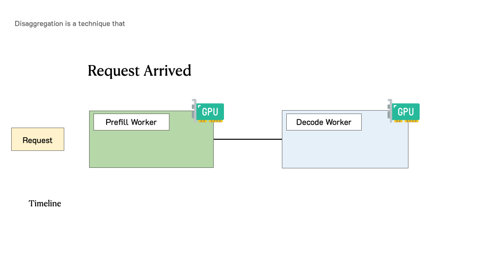

# 实验八：PD分离的vllm实践
## 实验任务
本次实验旨在利用vllm进行PD分离的实际部署，从而理解LLM的生产级PD分离推理实现，共包含两个任务：**PD分离的真机部署**（50分钟）和**PD分离的vllm实现分析**（100分钟）。
- **PD分离的真机部署**: 在GPU设备上利用vllm进行部署并且成功启动P/D/proxy服务，通过curl进行推理验证。
- **PD分离的vllm实现分析**: 分析vllm的PD分离相关实现，试图分析推理的工程实现细节（如kv-connecter的实现/proxy如何协作一条请求的全流程）
---

## 实验背景

LLM Serving场景主要关注两个服务指标（SLO：Service Level Objective）：
- TTFT (Time To First Token)：首 token 响应延迟，直接影响用户的等待体验。
- TPOT (Time Per Output Token)：衡量两个连续生成的 token 之间的平均延迟，决定交互的流畅程度。

因此对于MaaS（Model-as-a-Service）厂商，优化的目标就可以简单概括成：如何在保证SLO的基础上，最大化推理集群的吞吐，但是对于LLM推理的Prefill阶段（对应TTFT）和Decode阶段（对应TPOT）有着不同的特征，Prefill常常是**Compute-bound**，意味着算力可以打满，带宽不满，对于Decode是**Memory-bound**，意味着带宽可以打满，算力部分闲置，将Prefill和Decode混合在一起做LLM serving会带来资源利用率低下（代表的方法有chunked-prefill），目前对于主流的MaaS，PD分离已经变成LLM serving的标准。

PD分离直观的思路很简单：将 prefill 和 decode 分离到不同的 GPU 上，并为每个阶段定制并行策略。这自然带来了两个好处：
- 没有干扰：prefill 和 decode 各自独立运行，更快地完成计算，也更容易满足各自的 SLO。
- 资源分配与并行策略解耦：可以针对 prefill 和 decode 分别进行优化。

下图展示了在这样一个分离式系统中，请求是如何被处理的。当一个请求到达系统时，它会先被分配到 prefill worker 完成 prefill 阶段；随后系统将其中间状态（主要是 KV Cache）迁移到 decode worker，并执行多步 decode 以生成后续 token；当生成完成后，请求才会离开系统。




---

## 实验任务详解
### 任务一：PD分离的真机部署

#### 任务描述
1. **环境准备**：初始化python虚拟环境，安装vllm的latest版本
2. **模型准备**：选择Qwen/Qwen3-0.6B作为serving的LLM，可通过huggingface/modelscope下载到本地
3. **PD分离部署的大致流程**：
  - 阶段一：启动P节点，开启Prefill服务（例如：在8100端口服务）
  - 阶段二：启动D节点，开启Decode服务（例如：在8200端口服务）
  - 阶段三：开启Proxy服务（例如：在8000端口服务），可以理解为proxy负责协调P/D节点，对外提供serving服务
  - 阶段四：简单curl测试，例如：
  
```python
  curl -sS -N http://127.0.0.1:8000/v1/completions \
  -H "Content-Type: application/json" \
  -d '{
    "model": "Qwen/Qwen3-0.6B",
    "prompt": "Hello, my name is",
    "max_tokens": 8,
    "temperature": 0
  }'
```


注：PD分离部署主要针对于多卡推理的场景，由于实验环境限制（只有单张卡），可以把PD部署在同一张卡上，这只是为了跑通整个实验流程，同时由于单卡的限制，kvconector可以使用LMCacheConnectorV1类型。（使用其他的kvconector如果可以在单卡上跑通也可以）

---

### 任务二：PD分离的vllm实现分析
结合vllm的源码/官方文档/第三方资料，详细的讲讲vllm中PD分离的实现（latest版本的vllm），比如在P/D部署中的关键超参数的设置，总流程（比如worker，scheduler），kvconector的工作流程，不同类型的kvconector如何实现kvcache的不同形式的Prefill到Decode节点的传输（共享文件/CPU内存/GPU间NCCL），结合你的分析谈谈你对其中一些细节的理解。

注： 此部分不需要PD分离的一些宏观分析（如compute-bound，memory-bound等），需要的是工程实现级别的分析，如各种关键的超参数，中间关键的抽象层，整个流程如何协调等方面的分析，可以只关注vllm的PD分离相关的实现，不需要关注其他无关的组件。

---

## 实验资源

- [vllm github](https://github.com/vllm-project/vllm)
- [vllm docs](https://docs.vllm.ai/en/latest/)
- vllm经典paper： [PagedAttn Paper](https://arxiv.org/pdf/2309.06180)
- Proxy实现参考：[vllm lmcache proxy](https://github.com/vllm-project/vllm/blob/main/examples/others/lmcache/disagg_prefill_lmcache_v1/disagg_proxy_server.py)
- PD分离的相关paper：[DistServe](https://arxiv.org/abs/2401.09670) [Mooncake](https://arxiv.org/abs/2407.00079)

---

## 实验提交
实验提交只需要提供实验报告（PDF格式）：
   
   | 内容要求                | 分值占比 |
   |-------------------------|----------|
   | 任务1: 记录一下你vllm部署的过程（可以包括遇到什么bug，如何解决的）   | 50%      |
   | 任务2: PD分离的vllm实现分析  | 50%      |